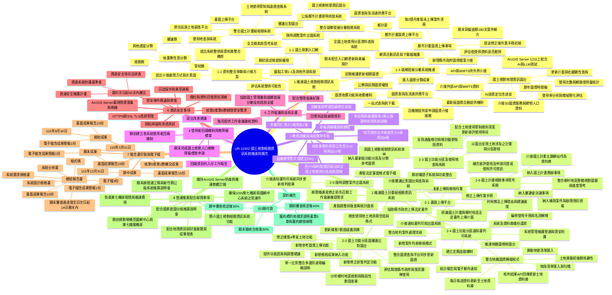

# UR-11502 徵求說明書工項心智圖

## 來源文件

- `03-UR-11502-徵求說明書.pdf`
  - 第 5 章第 1 節：工作項目階段劃分與工項內容，PDF 第 28-34 頁。
  - 第 5 章第 2 節：交付項目及時程表，PDF 第 35-36 頁。
- `02-UR-11502-資訊服務採購契約(1131226).odt`
  - 第 2 條履約標的：指向徵求說明書第 5 章及契約履約期限。
  - 第 5 條付款條件：依期初、期中、期末成果報告分 40%、30%、30% 付款。

## Mermaid 心智圖

## 工項對照摘要

| 工項 | 主題 | 核心產出 |
|---|---|---|
| 1 | 維運國土規劃相關資訊系統 | 入口網、資料整合介接方案、城鄉發展分署系統維運與功能修正 |
| 2 | 維運國土計畫組相關資訊系統 | 書圖上傳、審議比對、查詢、通知書列印、出圖、管考等 6 個子系統 |
| 3 | 教育訓練與系統教學手冊 | 訓練構想、訓練場次、教學影片或 FAQ、依回饋修正系統 |
| 4 | 使用者回饋與無障礙標章 | 回饋機制、月報建議、入口網無障礙標章申請 |
| 5 | 工作會議 | 每月議程、會議紀錄、處理情形、技術諮詢與支援 |
| 6 | 資訊安全 | 防護基準、自評表、資安維護計畫、弱掃滲測、備份與復原演練 |
| 7 | 報告書與電子檔 | 期初、期中、期末、總結報告與程式碼等交付物 |
| 8 | 營運推廣 | 推廣說明會、國家底圖推廣、機房維運、移機備援、軟體訂閱 |

## 閱讀重點

本案工項的主軸不是單純維運，而是「多系統整合 + 圖資流通 + 國土功能分區制度轉軌支援」。其中風險與工作量最高的區塊集中在：

1. 工項 1-2 的跨系統整併、資料庫整合與介接方案。
2. 工項 1-3 的圖資平台、GIS 圖台、AI/LLM 測試與都市計畫圖資介接。
3. 工項 2-4 的通知書列印系統與地籍異動、核判流程、土地資料庫 API 更新。
4. 工項 6 的資安文件、弱掃滲測、備份還原與 ArcGIS Server 漏洞修補。
5. 工項 7 的階段性交付與契約付款節點，會直接影響專案驗收與現金流。
